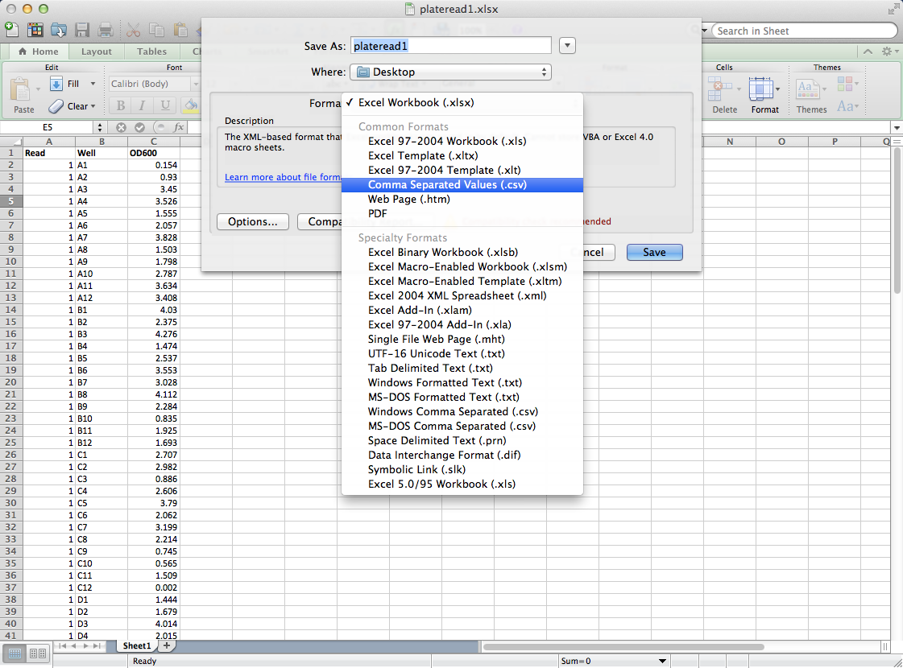
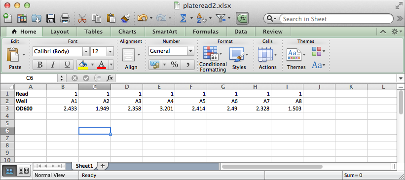
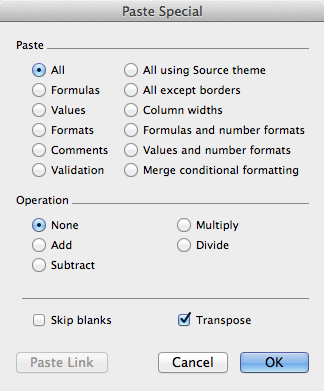

# Working with CSV datasets

Comma-separated value (CSV) files provide an application-agnostic way of 
storing and importing data into many applications. Because their content
is plain-text, they have a longer "shelf life" than proprietary file-formats
that depend on particular versions of applications. Dryad, the online data
repository, often requires uploaded data be in plain-text formats such as 
CSVs because of this reason. Despite all the obvious benefits of dealing with 
data in plain-text, several journals such as Evolution, Molecular Ecology, and 
AmNat are requiring data be made available in Dryad.

## Overview

While there is no real structure to CSV files, there is a common format often
followed when dealing with data. In particular, data should be organized as a
table where each entry has the same number of elements. Each of these entries 
in the table is a line in the CSV file, and each element in an entry is
delimited with a specified separator (typically a comma, hence CSV, though it
need not be). Elements are not limited in content, as long as they are
represented as plain-text. For example, this is a valid CSV entry:

    One, 2, 3.0, 8/2

Two other useful conventions in CSV files are headers and comments. Comments 
are identified by a single character, typically `#`, at the beginning of a
line. Any text after the comment character is conventionally ignored by most
(but not all) programs. A header row is used to assign names to each column in
a dataset. Here is a small dataset employing both headers and comments:

    # This data set has both comments and headers
	Treatment, Replicate, Fitness
	1, 1, 1.0
	1, 2, 1.5
	2, 1, 1.1
	2, 2, 1.6

The most unintuitive case (for me) of drafting data sets in the CSV format is
the time-series. But once you get the hang of thinking about your data in a 
tabular format, it will become second nature. Here is an example of a time series in
CSV format:

    # A fake dataset of fitness over time
	Treatmet, Replicate, Time, Fitness
	1, 1, 1, 1.0
	1, 1, 2, 1.1
	1, 1, 3, 1.2
	1, 1, 4, 1.3
	1, 2, 1, 1.0
	1, 2, 2, 1.0
	1, 2, 3, 1.1
	1, 2, 4, 1.5

## Python and CSV files

There are a number of different ways for interacting with CSV data in Python.
All Python distributions include the csv module, described below, which allows
for reading and writing CSV-formatted data. Additional modules such as numpy
and Pandas also offer powerful tools for interacting with CSV-formatted
datasets. This section introduces each of these tools.

### Python's csv Module

* TODO: regular stuff
* TODO: dict stuff

### NumPy/scipy

* TODO: using genfromtxt - delimiter, names, etc.  automatically decompresses. 

    d = np.genfromtxt('Tax_Year_2007_County_Income_Data.csv', delimiter=',', names=True, comments='#', usecols=(0,1,3,4))

    np.mean(d['State_Code'])

Can use the unpack argument, which is helpful for plotting:

    (xvals, yvals) = np.genfromtxt('Tax_Year_2007_County_Income_Data.csv', delimiter=',', names=True, comments='#', usecols=(0,4), unpack=True)

* TODO: working with aggregates of datasets (stacking tables from replicate runs)

### Pandas

[Pandas](http://pandas.pydata.org) is a Python library designed to support data
reading, writing, and manipulation.  Notably, Pandas also includes
functionality for working with timeseries data.

DataFrame

#### Reading CSV

TODO: describe example

    import pandas as p
    data = p.read_csv("Tax_Year_2007_County_Income_Data.csv", header=0)

TODO: adding, deleting, and selecting rows

    sc = a['State Code']
    sc[sc < 3]

TODO: grouping

## R and CSV files

brief overview of R and CSV

### Reading CSV files

TODO

### Writing CSV files

TODO

## Excel and CSV files

Support for reading and writing data in CSV format is included in Microsoft
Excel and each of the Excel-like spreadsheet programs (e.g., Numbers, Google
Docs, OpenOffice Calc). Like with the native formats, CSV files can be opened
with the **Open** item in the **File** menu.

To save data as a CSV file in Excel, the **Save As** item in the **File** menu
is used. Shown below, the *Format*  should be set to *Comma Separated Values
(.csv)*.  Menu options for other spreadsheets vary slightly.

### Transposing HORIZONTAL Data

CSV data is intended to be row-based, with each row representing a data point.
To export data that have been arranged in a column-based layout (see example
below), the data must first be transposed.

The easiest way to accomplish this is to select the data and copy it. Then,
select the cell that will be at the upper left area of the transpose data,
select **Paste Special...** from the **Edit** menu, and choose the *Transpose*
option before selecting the **OK** button.

Now that the data are arranged in rows, the other data can be deleted, and the
spreadsheet can be saved as a CSV file as described previously. This method of
copying data and pasting transposed is only supported in Excel and OpenOffice
Calc.

In Google Docs (as well as Excel), data can be transposed using the
**TRANSPOSE** function. To do this, first select a region of empty cells that
is equal in size to the data to be transposed.  For example, if the
column-based data occupies 3 rows by 9 columns as in the picture above, select
an area that is 9 rows by 3 columns.  Once the target region has been selected,
enter:

    =TRANSPOSE(A1:I3)

To take the data from the region bounded by cells A1 in the upper left and I3
in the lower right, transpose it, and paste it into the selected region. Excel
users should conclude entering this formula with Control-Shift-Enter instead of
Enter.

Unfortunately, Numbers does not provide any easy ways to transpose data.  The
best plan for these situations would be to export the column-based data as a
CSV file, read that file using the Python tools described in this Chapter, and
transpose the data in Python with a function like *transpose* in NumPy.

### Replacing Newlines when using Unix Environments

## CSV files and UNIX shells

your_cmd | sed "1 d" - to remove first line of output

TODO: intro

